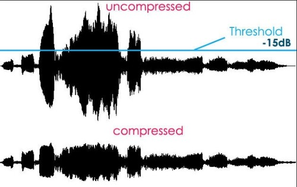

# DRCTransformer

**DRCTransformer** — Dynamic Range Compression for Robust Feature Scaling. A sklearn-compatible transformer that gently compresses outliers and out-of-distribution (OOD) samples while preserving the underlying data structure, inspired by audio dynamic processing.

**DRCTransformer** — Сжатие динамического диапазона для надежного масштабирования функций. Совместимый со sklearn преобразователь, который мягко сжимает выбросы и выборки, не относящиеся к распределению (OOD), сохраняя при этом базовую структуру данных, основанную на динамической обработке звука.

## Как это работает



## Установка

```bash
pip install git+https://github.com/KirillShiryaev61/drc_transformer.git
```

## Импорт

```
# Трансформер для использования в пайплайне
from drcompress.transformer import DRCTransformer
```